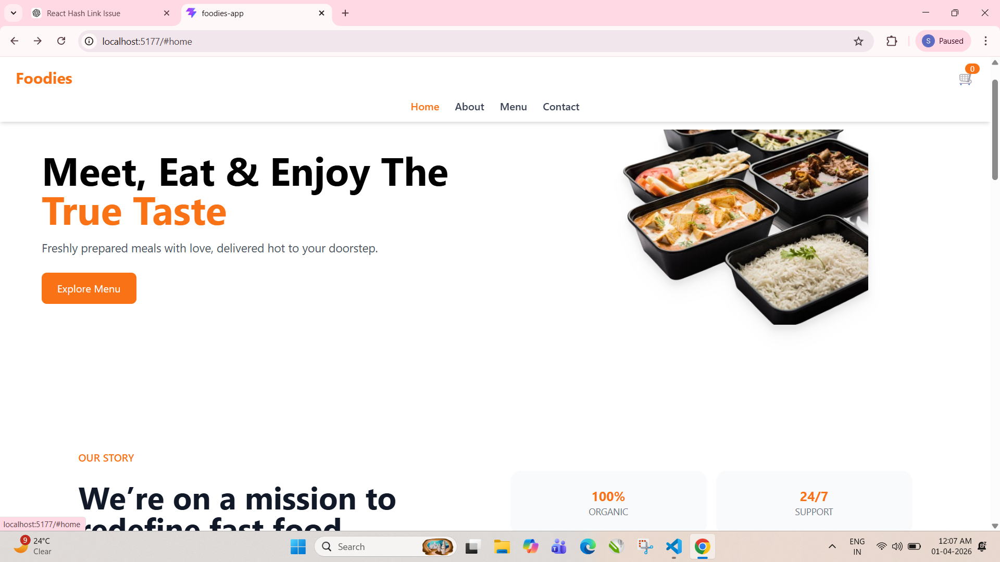
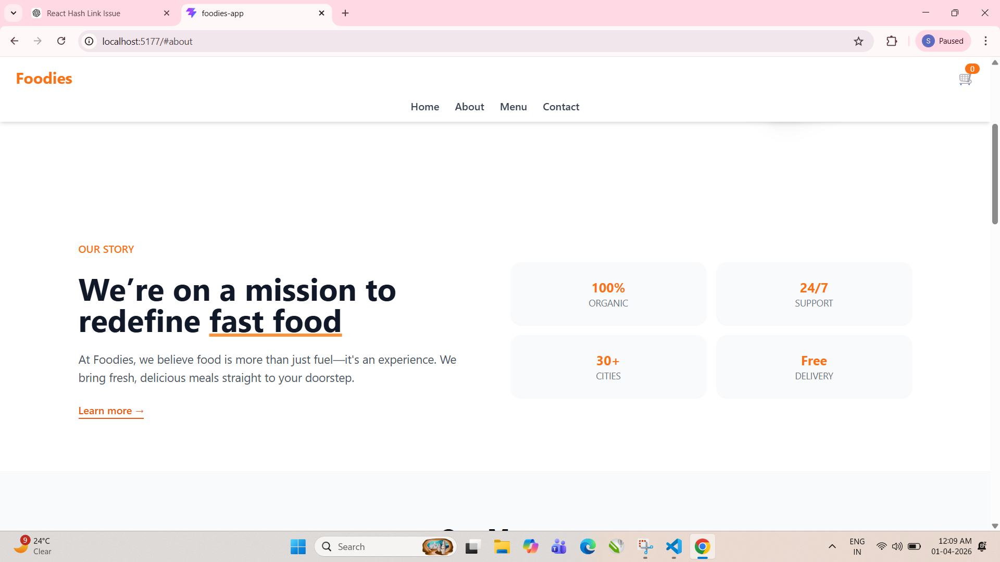
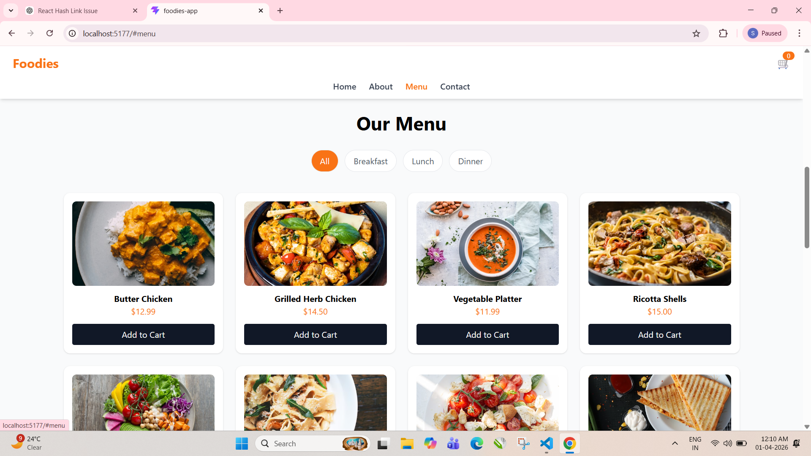
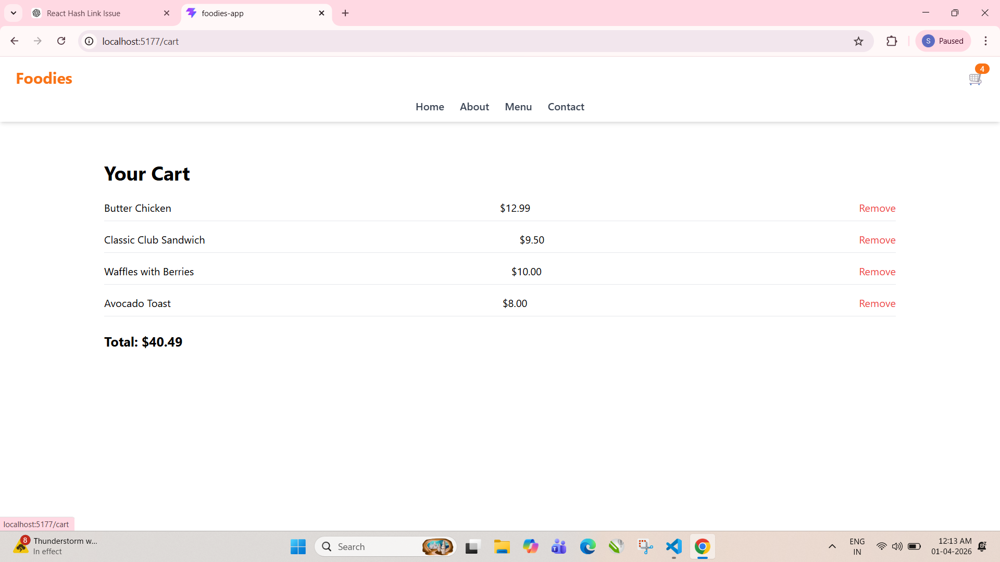
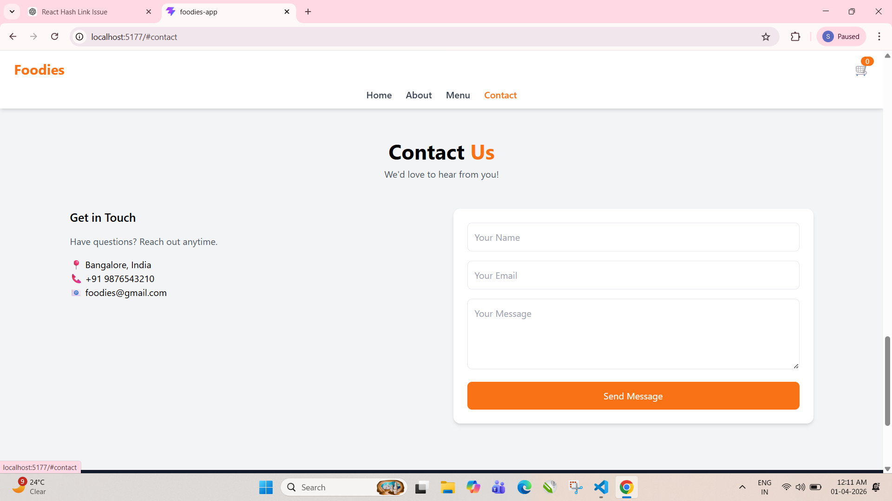

# Foodies - Restaurant Landing Page



**Foodies** is a responsive React.js restaurant landing page that showcases a modern, interactive menu and cart functionality. It’s designed to provide users with a smooth browsing and ordering experience.
 
[](https://shraddha-react-foodies-app.netlify.app/)

---

## 🌟 Features

- Fully responsive design for mobile, tablet, and desktop
- Smooth scrolling to sections (Home, About, Menu, Contact)
- Interactive **Menu** section with category filters (Breakfast, Lunch, Dinner)
- **Cart functionality** to add and remove items dynamically
- **Mobile-friendly navbar** with hamburger menu
- Contact form UI for user inquiries
- Footer with quick links and social icons

---

## 🛠️ Technologies Used

- **React.js** - Frontend framework
- **React Router** - Routing and navigation
- **Tailwind CSS** - Utility-first CSS framework
- **React Icons** - Icons for UI elements
- **Context API** - State management for Cart

---
## 📸 Preview
### 🏠 Home Page


### 👩‍💻 About Page


### 📁 Menu Page



### 📁 Cart Page



### 📁 Contact Page


---

## 📂 Folder Structure

foodies/
├─ public/
├─ src/
│ ├─ assets/ # Images and icons
│ ├─ components/
│ │ ├─ Navbar.jsx
│ │ ├─ Hero.jsx
│ │ ├─ About.jsx
│ │ ├─ Menu.jsx
│ │ ├─ Contact.jsx
│ │ └─ Footer.jsx
│ ├─ context/
│ │ └─ CartContext.jsx
│ ├─ pages/
│ │ └─ Cart.jsx
│ ├─ App.jsx
│ └─ index.jsx
├─ package.json
└─ README.md


---

## 🚀 Getting Started

### Clone the repository

```bash
git clone https://github.com/your-username/foodies-website.git
cd foodies-website
